# 🏭 Azure Data Factory End -To-End

## 📌 Descripción
Este proyecto tuvo como objetivo fortalecer mis habilidades en Azure Data Factory, realizando la migración de tablas desde SQL Server mediante un **Integration Runtime Self-Hosted**.
Se implementó un sistema de alertas automáticas por correo electrónico utilizando **Logic Apps** para notificar fallos en los pipelines.
Además, se aplicó la **arquitectura Medallion** (Layers Bronze, Silver y Gold) para estructurar y optimizar el flujo de datos, garantizando una mayor calidad y trazabilidad en el proceso de transformación.

## 🎯 Objetivos

- Migrar datos de SQL Server a Azure con Integration Runtime.

- Aplicar arquitectura Medallion para optimizar datos.

- Configurar alertas automáticas con Logic Apps.

- Usar Azure Key Vault para mayor seguridad en credenciales.

## 🚀 Tecnologías Utilizadas
🛢  SQL Server

🏭 Azure Data Factory

🐙 GitHub

🔑 Azure Key Vault

## 💻 Desarrollo
Este proyecto, desarrollado en Azure Data Factory, consistió en la migración de tablas desde SQL Server y la extracción de datos en formato JSON desde GitHub.
Se implementó Azure Key Vault para reforzar la seguridad en el manejo de credenciales y se utilizó Azure Data Lake Gen2 para almacenar la información en las capas Bronze, Silver y Gold, aplicando control de versiones mediante GitHub.

  

## 📒 Grupo de recurso
Desde el portal de Azure se creamos el grupo de recursos, dentro del cual se implementaron de manera individual los servicios necesarios para el proyecto: Azure Key Vault, Azure Data Lake Gen2, Azure SQL Database, Azure Data Factory y Logic Apps.

  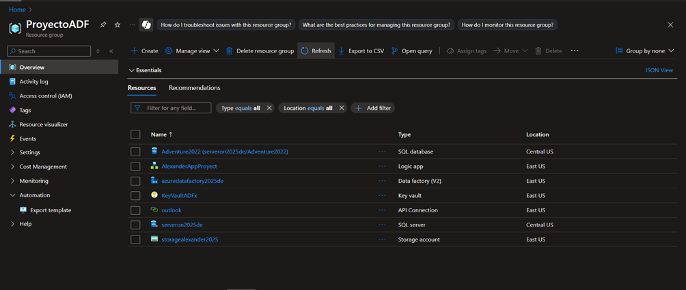

## 🛠️ Integration Runtime
En esta ocasión, como el objetivo es obtener las tablas desde SQL Server, se utilizó un Integration Runtime Self-Hosted para la configuración de la conexión, permitiendo migrar datos desde entornos on-premise hacia la nube.

  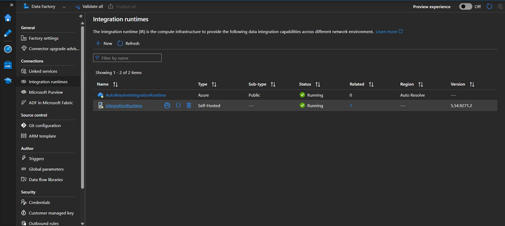

## 🔗 Linked Service
En este proyecto, el uso de Linked Services permite establecer conexiones con recursos externos desde los cuales queremos obtener.
En este caso, se empleó Azure Key Vault para gestionar de forma segura las credenciales utilizadas por los propios Linked Services, además de configurar conexiones hacia Azure SQL Database, Azure Data Lake Gen2, Web y SQL Server.

  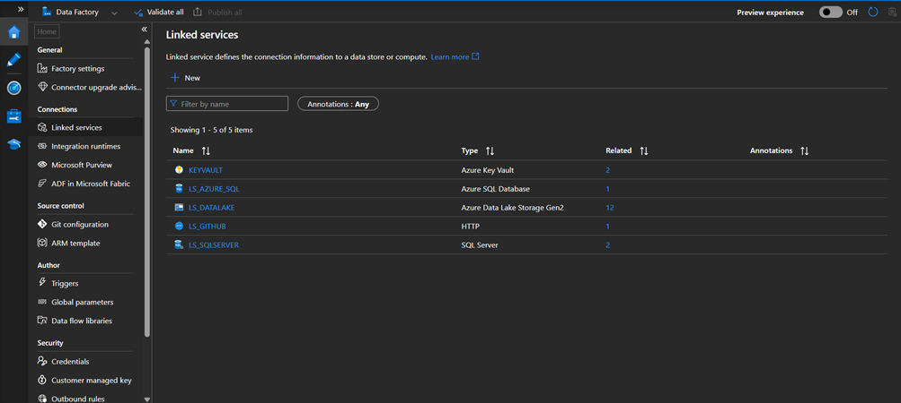

## 🧪 Pipeline
El pipeline PL_MIGRACION_OP, mediante la actividad Lookup configurada con una consulta SQL, obtiene la lista de tablas que comparten el mismo schema por defecto (dbo).
Para hacer más dinámico el proceso de migración, se utilizó una actividad ForEach que recorre y procesa cada una de las tablas provenientes de SQL Server.

  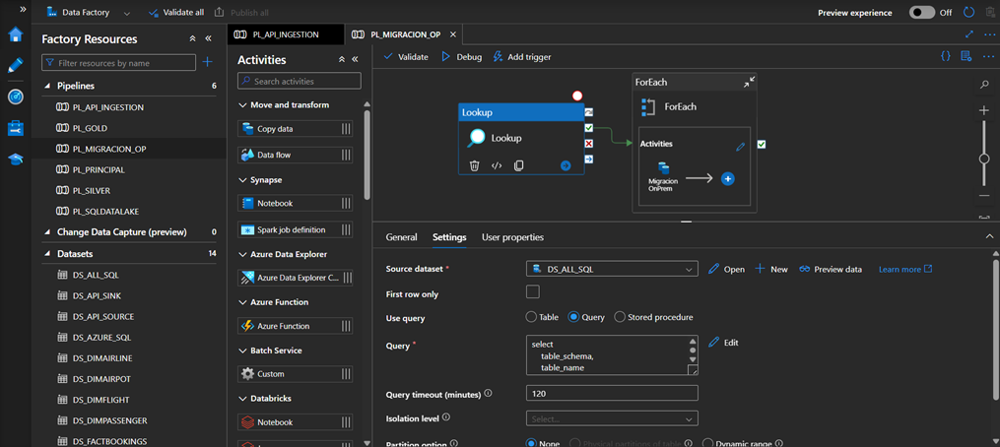

Dentro del ForEach, se utilizaron parámetros para optimizar la conexión y transferencia de la información.
En este caso, se empleó el mismo nombre tanto en el source como en el sink, y los datos resultantes se almacenaron en Azure Data Lake Gen2 en formato Parquet.

  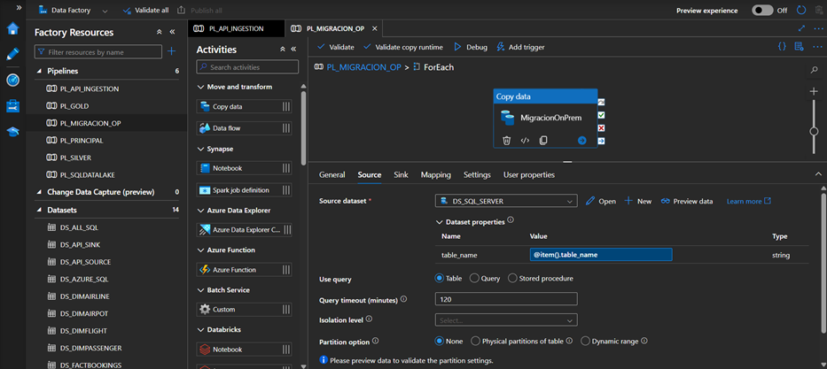

Se obtuvo el archivo DimAirport.json desde GitHub mediante la actividad Web de Azure Data Factory.
Para ello, se utilizó la URL del archivo de la opción raw, lo permitió acceder directamente a su contenido y procesarlo dentro del pipeline.

  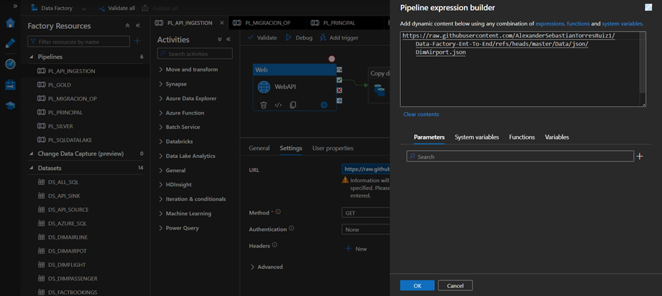

Finalmente, este archivo JSON se envió a nuestro Data Lake Gen2, dentro de la carpeta Bronze y la subcarpeta GitHub, con el fin de mantener una mejor organización y mapeo de los datos.

  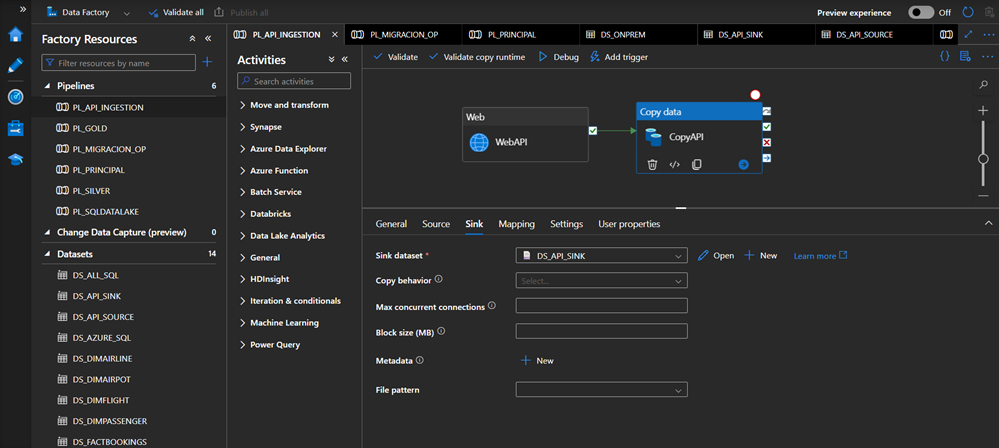

En el pipeline PL_SQLDATALAKE se aplicó una técnica moderna de carga incremental, utilizando dos actividades Lookup.
En la primera, se definió una fecha inicial por 1900-01-01, y en la segunda, se obtuvo la fecha máxima disponible mediante una consulta SQL.
Esta configuración permitió realizar la carga incremental de manera dinámica y eficiente.

  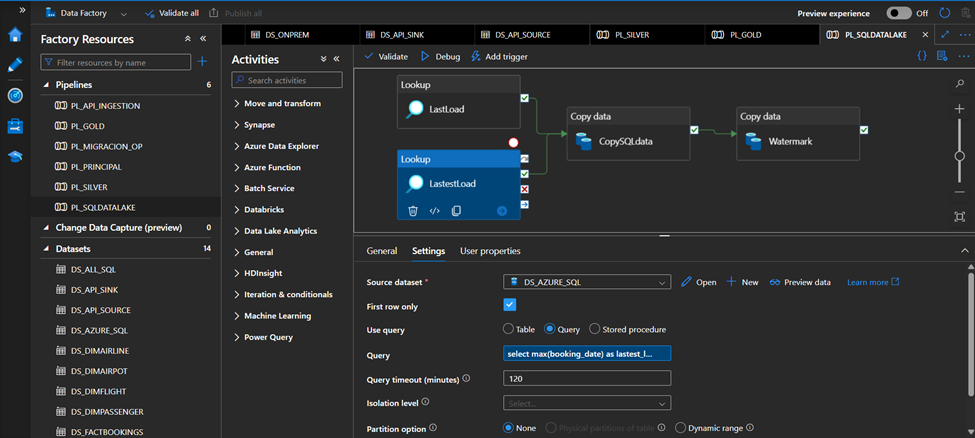

Dentro de la actividad Copy Data, se ejecuta una consulta SQL filtrando los registros cuya fecha sea mayor a la de LastLoad y menor a la de LatestLoad.
Este enfoque permite obtener únicamente las filas nuevas.
Posteriormente, en la actividad Watermark, se actualiza nuevamente la fecha de referencia con la última obtenida, de manera que cada vez que ingresen nuevos datos, las fechas iniciales se actualicen constantemente.

  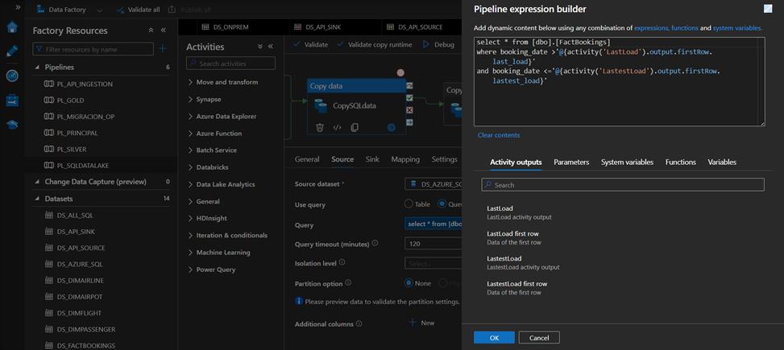

Mediante el uso de Execute Pipeline, se logró orquestar la ejecución a nivel de pipelines, lo que permitió un mejor control y manejo del flujo de procesos.
Además, se configuró una alerta utilizando la actividad Web, la cual se conecta con Logic Apps para notificar cualquier incidencia en la ejecución.

  

## 💻 Logic App

Dentro de Logic App, se definió el JSON en la sección Request y, posteriormente, en la actividad Email se configuró el mensaje dinámico que se enviará.
Al finalizar, se obtuvo la URL del flujo, la cual fue utilizada en la actividad Web del pipeline para establecer la conexión y enviar las alertas.

  

## ⛏️ Data Flows
Dentro de nuestro de DataTransform, se define la fuente de datos y se aplica las transformaciones necesarias, incluyendo la limpieza y modificación de los datos para asegurar su calidad. Finalmente, los datos transformados se almacenan en formato Delta dentro de nuestro Data Lake, específicamente en la subcarpeta denominada silver.

  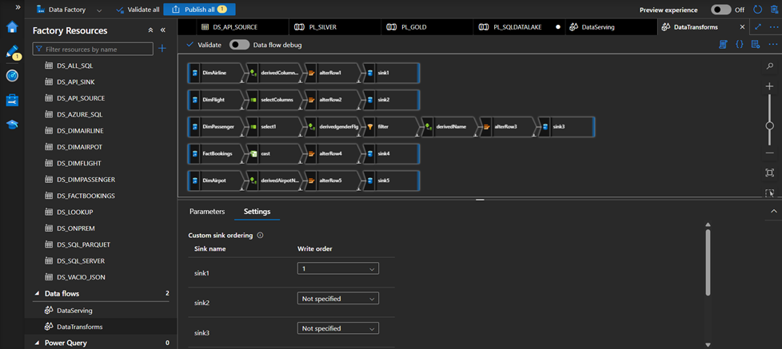

Finalmente, en nuestro proyecto aplicamos operaciones de join para combinar tablas y así obtener información empresarial relevante para la toma de decisiones. En particular, obtuvimos el top 5 de reservas por aerolínea, lo que permite analizar el desempeño y comportamiento del mercado.

  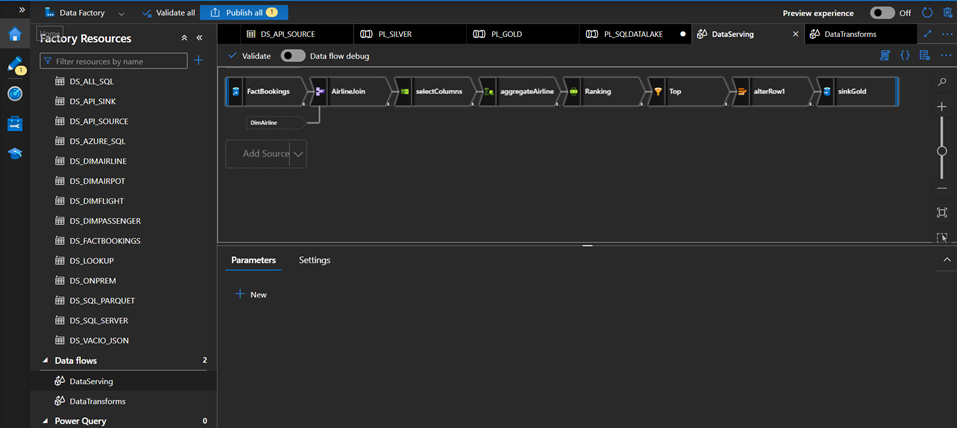

## 🐈‍⬛ GitHub

## 📚 Conclusion
